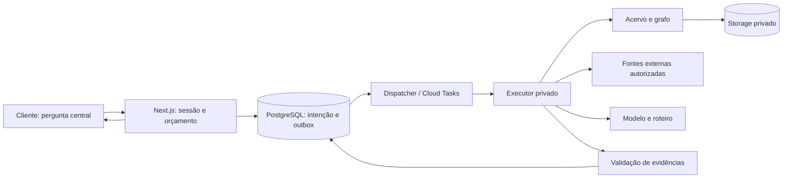

# NexoJuris — arquitetura e implementação do site completo

Data: 05/10/2026, America/Fortaleza. Plano geral para revisão; decisões técnicas abaixo são a proposta de implementação, não infraestrutura já contratada ou habilitada.

## 1. Objetivo, decisões e precedência

Estudar Direito de forma integrada a partir de uma pergunta central livre. O mecanismo interpreta a pergunta, consulta o acervo e o grafo jurídico, complementa evidências em fontes autorizadas e organiza leitura, conexões e aprofundamentos. O grafo sustenta a pesquisa; sua apresentação não exige uma rede visual.

Decisões já estabelecidas: doutrina em PDF/Markdown fornecida por Boni; banco antes da internet; web para lacunas/atualização; referências discretas sem buscas ou links; modos Compreender/Comparar/Aplicar; roteiros internos por tarefa; CF como base legislativa e conexões externas quando pertinentes. Primeiro teste: controle de constitucionalidade. Material piloto: arquivo fornecido, exatamente como enviado, sem condicioná-lo a complementações, metadados bibliográficos ou ajustes.

Este documento governa arquitetura, infraestrutura e sequência de entrega de um produto novo e independente. O plano `docs/superpowers/plans/2026-10-05-pesquisa-integrada.md` detalha somente o núcleo local; deve ser lido com as atualizações deste documento. Os documentos anteriores que pressupõem integração com outro produto não constituem requisitos deste planejamento. Não há reaproveitamento presumido de infraestrutura, autenticação, banco ou serviços de outro projeto.

Separar três aceites: núcleo local → site em homologação com contas → operação comercial. O primeiro teste não exige que assinatura esteja pronta; a arquitetura comercial é planejada desde agora.

## 2. Estado inspecionado

| Item | Confirmado nesta conversa | Limite |
|---|---|---|
| Repositório | Next.js 16.3.8, React 19.3.0, TypeScript, `src/`, npm, branch `foundation/nexojuris`, HEAD inicial `562aa18` | Dependências e build ainda não instalados/validados |
| Experiência | Workspace demonstrativo, protótipo HTML e dois testes de navegação aprovados | Pesquisa real, grafo, contas e cobrança não implementados |
| Material | Markdown fornecido em caminho local; aceito como enviado | Conteúdo não importado ao banco nesta etapa |
| Ambiente Windows | Node 24, npm, Git, gcloud e Docker encontrados | Daemon Docker sem conexão; não foi iniciado |
| Infraestrutura própria | Nenhum recurso NexoJuris provisionado por esta tarefa | Hosting, cloud, banco gerenciado e identidade são escolhas novas |
| Domínio | Endereço próprio ainda não configurado por esta tarefa | Disponibilidade, posse e configuração não comprovadas |

Não listar credenciais, arquivos de conta ou valores de segredos no inventário. Inspeções de outros produtos não são fonte de verdade da infraestrutura NexoJuris e foram excluídas deste plano.

## 3. Stack e serviços escolhidos

| Camada | Proposta definida | Implementação/limite |
|---|---|---|
| Frontend e API | Next.js App Router + React + TypeScript | Manter `src/`, Route Handlers e CSS/tokens próprios; sem frontend Vite paralelo |
| Runtime/build | Node 24 LTS, npm e imagem Docker standalone | Fixar dependências e imagem por versão/digest; não copiar `.env` para imagem |
| Banco e grafo | PostgreSQL 18, driver `pg`, migrations SQL | Grafo em tabelas de entidades/relações/evidências; sem Neo4j inicial |
| Pesquisa interna | Full-text português, aliases, resolução literal e travessia do grafo | Recuperação lexical primeiro, busca semântica adicionada pela avaliação descrita abaixo |
| Vetores | pgvector no mesmo PostgreSQL, quando o benchmark justificar | Sem Qdrant/Pinecone/Elasticsearch ou dimensão fixada sem modelo |
| Extração | Markdown por estrutura/linhas; PDF textual com `pdfjs-dist` | Scripts TypeScript; OCR não integra primeiro teste |
| Aplicação cloud | Cloud Run `nexojuris-web-{env}` | 1 vCPU/1 GiB, min 0, max 3 e concorrência 20 como ponto de partida de homologação |
| Executor cloud | Cloud Run privado `nexojuris-executor-{env}` | 1 vCPU/1 GiB, min 0, max 2, concorrência 2; IAM/OIDC obrigatório |
| Ingestão e manutenção | Cloud Run Jobs | Mesma base de código, comandos separados; timeout 30 min, 1 tarefa por lote inicial |
| Fila de estudos | Cloud Tasks + outbox PostgreSQL | Operação longa não depende do navegador manter conexão |
| Arquivos | Cloud Storage privado | Originais, snapshots e exports; filesystem do container não é persistência |
| Banco cloud | Cloud SQL PostgreSQL 18 Enterprise | Instância exclusiva por ambiente; homologação single-zone; lançamento comercial regional HA |
| Segredos | Secret Manager + identidades de serviço | Permissões por recurso; nenhuma service-account key no Git |
| Login | Firebase Authentication/Identity Platform | E-mail/senha verificado e Google; sessão validada no servidor com Firebase Admin |
| Domínio/TLS | Load Balancer HTTPS global + serverless NEG + certificado gerenciado | Cloud Run domain mapping direto não será usado; DNS preparado antes de alteração |
| Artefatos/CI | Artifact Registry + GitHub Actions com Workload Identity Federation | Sem segredo JSON de conta de serviço; build/test separados de promoção |
| Operação | Cloud Logging/Monitoring + Error Reporting | Métricas sem texto completo das obras ou perguntas |
| Pagamentos | Adaptador próprio Mercado Pago de assinatura | Ledger NexoJuris, sandbox antes de operação comercial |

A proposta utiliza Google Cloud como destino completo, sem acrescentar Vercel ou Supabase. Serviços gerenciados só são provisionados quando houver orçamento aprovado. Desenvolvimento local antecede custo fixo cloud.

### Domínio e ambientes

- Desenvolvimento: `localhost:3000`, PostgreSQL isolado local, originais fora de `public/`.
- Homologação: `hml.estudo.nexojuris.ia.br`, login obrigatório e lista de usuários convidados; indexação bloqueada.
- Produção: `estudo.nexojuris.ia.br` como endereço proposto, condicionado à disponibilidade e escolha do proprietário. Não pressupõe relação com nenhum serviço existente.
- Região de aplicação, executor, SQL e bucket: `southamerica-east1`; verificar disponibilidade/quota durante inventário, sem mudar silenciosamente para outro país.
- Criar projetos Google Cloud novos e distintos para homologação e produção. IDs são gerados com sufixo único e registrados em `ops/environments.json`; scripts exigem destino explícito e recusam recursos fora desses projetos novos.
- Contas de serviço: web, executor, ingestão, migração, dispatcher e CI separadas. Somente CI promove imagens; usuário web não migra schema nem publica fontes.
- Cloud SQL com IP privado, acesso por Direct VPC egress e conector de autenticação; desenvolvimento usa Auth Proxy apenas quando acesso remoto estiver autorizado.
- Pool máximo 5 conexões por instância web e 5 por executor; limite total calculado com máximos de instâncias e jobs, mantendo margem para migração/manutenção. Não escalar aplicação além da capacidade SQL.

DNS/TLS/OAuth são um pacote de mudança revisável: exportar registros atuais, identificar apenas os novos subdomínios, configurar callbacks e testar certificado/cookies antes de promover tráfego. Nenhum comando troca domínio raiz ou faz override de mapeamento existente.

## 4. Motores de pesquisa, grafo e IA

### Acervo e grafo

`source_document`, `source_version`, `source_passage`, `legal_device`, `device_version`, `legal_entity`, `legal_alias`, `legal_question`, `legal_relation` e `relation_evidence` formam o acervo. Versões são imutáveis; mudança cria versão e revisão de vínculos afetados. Hash identifica o arquivo, título pode ser o nome enviado e metadados não fornecidos permanecem desconhecidos. O arquivo piloto não precisa ser reformatado.

O grafo é muitos-para-muitos. Uma consulta identifica pontos de entrada por conceitos/questões/dispositivos e recupera vizinhança comprovada. Evidência de uma menção não autoriza converter automaticamente em concordância, interpretação ou posição dominante. Relações globais têm revisão; conexões contextuais da sessão podem ser propostas com passagens e origem explícitas, sem poluir o grafo publicado.

### Recuperação e busca semântica

Primeira entrega: full-text, aliases, busca literal e grafo, com termos originais preservados. Esta escolha permite medir o primeiro circuito sem indexação paga prematura; não significa que o produto final se limite a palavras exatas.

Preparar interface `EmbeddingProvider.embed(texts): Promise<EmbeddingBatch>` e índice versionado. Antes de ampliar corpus, comparar dois modelos multilíngues disponíveis na mesma avaliação revisada, registrando licença, dimensão, recall@10, nDCG@10, latência, espaço e custo. Testar fusão RRF entre lexical e vetor, com constante 60; grafo continua fornecendo relações comprovadas. Publicar vetores somente se mantiver busca literal/filtros e aumentar perguntas respondíveis com passagem relevante no top 10 sem introduzir fontes em rascunho. Nenhum modelo de embedding será escolhido apenas pela popularidade.

O gate de primeiro teste permanece lexical+grafo. A seleção de embedding é uma entrega medida com regra definida, não instalação obrigatória antes de existir corpus. Não adotar banco de grafos separado sem evidência de limite do modelo relacional.

### Modelos e roteiros

Separar planejamento de pesquisa, execução de ferramentas e redação. O servidor controla ferramentas; o LLM retorna estruturas validadas, não SQL ou código executável.

Adaptadores reais de produção: Gemini `generateContent` e Anthropic Messages; compatível com Chat Completions para modelo local/teste técnico. `ModelProfile` guarda fornecedor, ID, contexto, saída, limites de ferramenta, custos e capacidades por objetivo. A escolha do cliente mantém o mesmo roteiro; não substituir por modelo mais caro automaticamente.

Perfis candidatos consultados em documentação oficial em 05/10/2026: Flash → `gemini-3.8-flash`; Sonnet → `claude-sonnet-5-5`; Opus → `claude-opus-5-5`. Esses IDs são candidatos de configuração, sem chamada ou disponibilidade na conta comprovada. Luna fica indisponível até sua identidade real ser definida; não herdar preço zero. O primeiro teste pode rodar com um único perfil real habilitado. Revalidar catálogo, limites, termos e tarifa ao ativar cada perfil.

Roteiros versionados: compreender, comparar doutrina, comparar jurisprudência, aplicar, explicar artigo e explicar julgado. Cada roteiro exige entradas, saída, regras de evidência e ferramentas permitidas. Personalização inicial usa pergunta, objetivo e contexto do estudo; não inferir perfil psicológico ou histórico permanente do estudante.

### Internet e jurisprudência próprias

Interface `ApprovedSearchProvider.search({ query, sourceIds, limit, signal })`; cadastro inclui hosts/caminhos exatos, método permitido, parser, aprovação e data. Fontes propostas: STF, Planalto e STJ. Inspecionar método real de cada fonte antes de habilitar; nunca simular API ou usar snippets como acórdão.

Se fonte não tiver pesquisa acessível automatizável, implementar importação/snapshot administrado e retrieval local; reportar indisponibilidade de complementação ao vivo. Um serviço de busca web terceiro só entra com contrato/custo definidos, não como fallback oculto. Conteúdo doutrinário privado não é enviado integralmente em query pública. Validar redirects e destinos de rede para impedir acesso a endereços internos.

O NexoJuris terá adaptadores próprios de fontes oficiais STF/STJ e catálogo local de julgados com tribunal, classe, número, órgão, documento, versão e evidência. A pesquisa jurídica não depende de API de outro produto. O primeiro corpus usa arquivos/snapshots oficiais importados; pesquisa online entra conforme método confirmado por fonte. Uma futura integração com produto externo é decisão de escopo separada e não gate para o site funcionar.

## 5. Fluxo público e processamento durável

Local: executor síncrono para validar núcleo, com os mesmos contratos. Cloud: `POST /api/studies` reserva orçamento e grava execução+outbox na mesma transação; responde 202 com ID. O cliente consulta estado a cada 2 segundos enquanto ativo e desacelera após 30 segundos. UI mostra apenas progresso genérico, resultado e falhas, sem ferramentas/links.

Outbox é persistida antes do despacho; dispatcher autenticado executa imediatamente e Scheduler reconcilia pendências a cada minuto. Cloud Tasks carrega ID, nunca documentos ou segredos; invoca executor com OIDC. Lease por execução e checkpoints por etapa evitam dois workers ativos. Reentrega conclui a mesma intenção; erro após resposta incerta do provedor é registrado e não autoriza repetir cobrança cegamente. Não prometer exatamente uma chamada externa em falhas de rede.

Estados: `queued`, `running`, `needs_clarification`, `completed`, `limited`, `failed`, `cancelled`. Cancelar é cooperativo, interrompe próximas etapas e liquida custos comprovados segundo a política vigente. Reabrir resultado não gera atividade; atualizar fontes/modelo/escopo cria intenção nova.

Contratos públicos:

- `POST /api/studies` — `{question, objective, modelProfileId, quoteId?, requestId, resourceId?, sourceVersionId?, answer?}`; 202 em cloud, resultado síncrono no piloto local.
- `GET /api/studies/[id]` — status e projeção pública do resultado; sem URL de origem, trace ou prompts.
- `POST /api/studies/[id]/cancel` — cancelamento da própria execução.
- `POST /api/studies/[id]/clarification` — acrescenta esclarecimento à intenção pendente, mantendo referência e orçamento revisto quando necessário.
- `GET /api/connections/suggest?q=` — no máximo 6 conexões locais, sem LLM/web e com debounce na UI.
- `GET /api/studies` e `PATCH /api/studies/[id]` — histórico do dono e estado salvo.
- `POST /api/usage/quote` — cotação por objetivo/modelo/escopo; cliente não define preço.
- `POST /api/session`, `DELETE /api/session` — criação/encerramento de sessão server-side.

Resposta pública contém pergunta, seções com referências discretas, conexões contextualizadas, limitações e data. Identidade de recurso+versão+questão central evita painéis duplicados e conserva contexto durante aprofundamento.

## 6. Contas, fontes administrativas e segurança

Site público tem apresentação, login e explicação de consumo. Pesquisa gerativa exige conta, inclusive homologação. Cliente possui histórico, resultados e consumo; conteúdo doutrinário permanece acervo administrado pelo proprietário, não upload compartilhado irrestrito.

Firebase ID token trocado por cookie de sessão HttpOnly/Secure/SameSite=Lax, host-only e validade inicial de 5 dias; proteção CSRF nos métodos mutantes, validação de origem e revogação. Autorização do servidor associa UID a usuário local; escopo `admin` vem de cadastro administrado, nunca do navegador. Todas as queries de estudos/ledger filtram dono e testes tentam acesso entre usuários.

Admin: importação, versão, publicação e revisão de relações. Upload direto para bucket privado com autorização curta e limites; job de ingestão usa a mesma lógica do piloto e estados verificáveis. Usuário comum não recebe original doutrinário ou URL assinada por estar citado numa resposta. Sem autoria/edição informadas, preservar desconhecido e referência ao documento disponível, sem atribuição inventada.

Aplicação/executor usam IAM mínimo e queries parametrizadas. Limitar requisições gerativas por usuário e IP, com contador compartilhado em PostgreSQL, e não em memória de container. Segregar conteúdo, instruções e ferramentas; scripts internos não executam texto do arquivo. Logs estruturados guardam IDs, contagens, duração e códigos; traces com evidências são privados e restritos à revisão.

## 7. Consumo, planos e pagamentos

Navegar fonte existente, conexão publicada e resultado persistido não usa LLM. Gerar estudo, comparar ou corrigir resposta é execução cotada. Tarifas cobrem modelo, retrieval, pesquisa externa quando houver custo, infraestrutura variável, taxa de pagamento e rateio; preços simulados 0/1/3/8 e saldo 400 não são política comercial.

Ledger append-only: concessão, reserva, liquidação e liberação/estorno. Reserva transacional impede saldo negativo; key de intenção evita débito repetido. Cotação versionada fixa máximo, modelo, objetivo, escopo e validade de 10 minutos. O executor encerra antes de exceder o máximo; ampliar exige nova confirmação de consumo no produto.

Assinatura Mercado Pago separada: plano, assinatura, ciclo e evento. Webhook validado seguido de consulta ao provedor; browser callback ou `authorized` sem pagamento não concede franquia. Unicidade de concessão por produto/assinatura/ciclo; cancelamento, estorno e evento fora de ordem testados. Homologar apenas em ambiente apropriado, sem cobrança produtiva por inferência.

Política inicial proposta para lançamento: 30 dias de histórico temporário, 50 estudos salvos, exclusão por escolha do usuário ao atingir limite; registros financeiros têm ciclo de retenção separado. Documentar ciclo mensal e cotas antes da oferta comercial. Valores de preço e franquia serão calculados com o consumo do piloto, não arbitrados sem dados.

## 8. Capacidade, custos e recuperação

Instância SQL de homologação: Enterprise single-zone, 1 vCPU/3,75 GiB, SSD 10 GiB e crescimento automático; verificar disponibilidade e cotar antes de criar. Produção inicial: mesma ordem de capacidade, HA regional, backup diário e PITR. Não atribuir R$ estimado sem SKU/região/moeda confirmados.

Modelo de custo: custo fixo SQL + load balancer + armazenamento/backups + mínimos de serviços + logs/segredos; variável Cloud Run/Tasks + tokens/modelo + busca externa + tráfego + pagamentos. Medir cenários de 10/100/1.000 usuários ativos e 10/50/200 atividades mensais por usuário, com mistura de modelos explícita. Tabela em `docs/business/cost-model.md` deve calcular margem de contribuição e resultado operacional separadamente.

Antes de provisionamento, produzir orçamento com SKUs atuais e total mensal por ambiente; orçamento financeiro autorizado é entrada operacional necessária, sem fabricar valor aprovado. Budget alerts 50/80/100% são avisos, não hard cap. Hard caps de aplicação controlam chamadas/tokens, filas, instâncias e habilitação de perfis; SQL/HTTPS continuam gerando custo fixo.

Objetivos de recuperação propostos: RPO até 24h e RTO até 8h em homologação; RPO até 1h e RTO até 4h na operação inicial. São metas sujeitas a ensaio, não garantias. Backups SQL e versionamento de originais; restauração em ambiente separado deve reaplicar exclusões/tombstones. Logs 30 dias e expiração dos resultados temporários conforme política; backup não é acessível por histórico do cliente.

Métricas: latência por etapa, sucesso/limitação/falha, precisão de recuperação, validação de citações, custo por atividade/modelo, uso de conexões, idade da fila, fontes sem atualização e erros de pagamento. Alertar falha persistente de fonte, backlog >5 min, aumento de erro, perda de conciliação ou consumo fora do máximo; não registrar corpus em métricas.

## 9. Pacotes de execução e aceites

| Ordem | Entrega | Arquivos principais | Validação que encerra a etapa |
|---|---|---|---|
| 0 | Base técnica reproduzível | package/lockfile, Compose, `.env.example`, contratos/config | Instalação, 2 testes atuais, typecheck/build; DB de teste separado |
| 1 | Ingestão do arquivo fornecido e acervo | migrations fontes, CLI ingestão, `LocalStorage`/`GcsStorage` | Hash/original preservados, seções/linhas recuperáveis, replay idempotente |
| 2 | Grafo e pesquisa integrada | entidades/relações, recuperação, executor e roteiros | Pergunta livre recupera evidências e relações; limites/citações testados |
| 3 | UI do núcleo e primeiro teste | workspace/componentes, histórico local, avaliação | Pergunta→leitura→conexão→retorno; piloto de controle com conteúdo real |
| 4 | Contas e execução durável | sessões, ownership, outbox/dispatcher/worker | Dois usuários isolados, retomada após reload, retry/cancelamento e outbox |
| 5 | Infraestrutura como código | `ops/terraform/{modules,environments}`, Dockerfile, CI | `terraform validate/plan`, imagem reproduzível, destino explícito, orçamento cotado |
| 6 | Site de homologação e domínio | recursos hml, DNS/certificado/callbacks, jobs | Login e fluxo E2E cloud, fontes/acervo privados, smoke, restore e limites |
| 7 | Consumo comercial e assinatura | quote/ledger, Mercado Pago, conta/consumo | Concorrência, teto, webhooks duplicados/fora de ordem, sandbox e margem |
| 8 | Produção e operação | ambiente prod, runbooks, monitoração e promoção | E2E, QA visual, backup/restore, rollout/rollback e reconciliação comprovados |

Pacotes 0–3 usam o plano detalhado do núcleo, atualizado para aceitar o arquivo como foi enviado. Pacotes seguintes usam o detalhamento abaixo; não começar por DNS ou contratação enquanto o núcleo não existe.

### Pacote 4 — contrato de contas e execução

Criar `src/features/account/{session,authorization,study-history}.ts`, `src/features/research/jobs/{outbox,dispatch,claim,checkpoint}.ts`, `src/app/api/session/route.ts`, `src/app/api/internal/{dispatch,execute}/route.ts` e migration de ownership/jobs. Interface de armazenamento `putOriginal/getOriginal` permite local/GCS sem mudar ingestão.

Testes: `tests/account.integration.test.ts` para isolamento/revogação/CSRF; `tests/jobs.integration.test.ts` para transação sem tarefa perdida, dois claims, reentrega, reinício após etapa, cancelamento e resposta externa incerta. Dispatcher fake em teste local; Cloud Tasks só no ambiente provisionado. Aceite não depende de afirmar exactly-once do provedor.

### Pacote 5 — contrato de infraestrutura

Terraform define APIs, Artifact Registry, VPC/subnet, SQL privado, buckets privados, service accounts/IAM, secrets sem valores no state, Cloud Run, Tasks, Scheduler, HTTPS LB/NEG/certificados, logging/budgets e saídas de endpoints. `ops/environments.json` vincula projectId, região, URLs e banco por ambiente; CI valida que hml/prod não compartilham DB, bucket ou secrets.

CI faz `npm ci`, suites, typecheck/build e build da imagem; autenticação WIF restrita a repositório/branch/environment. Migrations executadas por job independente com conta própria e backups prévios quando necessário. Promover o mesmo digest validado, nunca rebuild diferente. Plano Terraform passa revisão de criação/custo; aplicar não é consequência automática de teste verde.

### Pacote 6 — aceite cloud

Provisionar apenas hml autorizado; importar corpus/snapshot sem exposição pública, configurar identidade e perfis de teste, executar estudos pelo worker e histórico por conta. Tests E2E em navegador real incluem host/cookies, rede móvel, reload, retorno, 320/736/1.024/1.440 px, teclado e movimento reduzido. O primeiro teste com adaptador fake não substitui modelo real ou acesso web real.

Domínio hml com certificado ativo e callbacks exatos; health `/api/health/live` sem dados e ready autenticado verifica DB/config. Ensaiar fila/retentativas, rejeição de OIDC, indisponibilidade de modelo/SQL/fonte e restauração. Registrar URLs, SHA/digest/revisão, versões de corpus e escopo do teste.

### Pacotes 7–8 — comercial e lançamento

Criar migrations específicas de uso/assinaturas, testes de corrida e provider replay; obter eventos reais de sandbox e registrar evidência sanitizada. Habilitar apenas preços/planos calculados, não placeholders. Promover produção com configuração isolada, tráfego gradual, indicadores e rollback para digest anterior; schema deve permitir rollback de aplicação por estratégia expand/contract.

Runbooks: importar/revisar, indisponibilidade de fonte/modelo, fila, orçamento, webhook/reconciliação, backup/restore, rotação de segredo e rollback. Operação comercial começa somente com aceite de custos, qualidade, autenticação, consumo e pagamento; publicação de hml não comprova lançamento.

## 10. Material piloto e próxima ação executável

Entrada aceita: `C:/Users/Boni Jr/Desktop/CPM E CPPM/output/hermeneutica-constitucional-3.1-a-3.10.2.6_ESTRUTURADO_IA.md`. Ler bytes UTF-8 e preservar arquivo/hash; se o CLI precisar de manifesto, gerá-lo internamente com título do filename e campos desconhecidos. Não pedir ao proprietário que reenvie, complete ou altere o material. Não redefinir o tema do teste a partir do título do arquivo.

Primeira ação de implementação: validar e instalar a base atual, gerar lockfile e obter build/typecheck; depois implementar ingestão desse Markdown e grafo com testes. Dependências externas em paralelo conceitual: credenciais de modelo e autorização das fontes podem ser configuradas quando seus adaptadores estiverem prontos. Recursos pagos, alteração DNS e publicação têm sua aprovação operacional própria, sem bloquear o desenvolvimento local.

## 11. Referências oficiais consultadas

- [Cloud Run: serviços, jobs e armazenamento externo](https://docs.cloud.google.com/run/docs/overview/what-is-cloud-run).
- [Domínios Cloud Run: HTTPS Load Balancer e limitações de domain mapping](https://docs.cloud.google.com/run/docs/mapping-custom-domains).
- [Cloud SQL: versões PostgreSQL](https://docs.cloud.google.com/sql/docs/postgres/db-versions) e [extensões](https://docs.cloud.google.com/sql/docs/postgres/extensions).
- [Identity Platform](https://docs.cloud.google.com/identity-platform/docs/concepts-authentication) e [sessões Firebase Admin](https://firebase.google.com/docs/auth/admin/manage-cookies).
- [Cloud Tasks com alvo HTTP](https://docs.cloud.google.com/tasks/docs/creating-http-target-tasks).
- [Catálogo Gemini](https://ai.google.dev/gemini-api/docs/models) e [catálogo Claude](https://platform.claude.com/docs/en/models/overview).
- [Preços Cloud Run](https://cloud.google.com/run/pricing). Orçamento final ainda precisa da cotação completa SQL/LB/storage/modelos na conta/região; não há total financeiro aprovado.

As referências apoiam capacidades e restrições, não disponibilidade na conta nem contratação. Neste turno foram produzidos documentos e inspeções read-only, sem provisionamento, DNS, chamada de IA, cobrança ou implantação.
